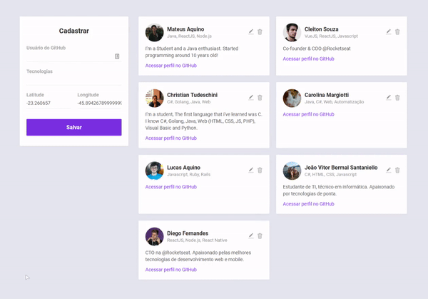

</img>
<h1 align="center">Semana Omnistack 10</h1>
<p align="center">Projeto <strong>DevRadar</strong> desenvolvido durante a Omnistack da Rocketseat</p>

## Instalação
Configure o MongoDB e atualize a string de conexão com seu `User:Senha` no arquivo `index.js`.  
Para instalar as dependências e executar o **Servidor** (modo desenvolvimento), clone o projeto em seu computador e em seguida execute:
```bash
cd backend
yarn install
yarn dev
```
Para iniciar o **Frontend** do React utilize os comandos:
```bash
cd frontend
yarn install
yarn start
```
Assim que o processo terminar, automaticamente será aberta no seu navegador a página `localhost:3000` contendo o Projeto desenvolvido no dia 3 de 5.  

Para testar o **Mobile** do React Native, primeiro coloque o endereço do seu servidor (ou computador) no arquivo `src/services/api.js`, e depois execute os comandos:
```bash
# NÃO é preciso executar a linha de baixo caso ja tenha o Expo (CLI) instalado!
yarn global add install expo-cli
cd mobile
yarn install
yarn start
```
Assim que o processo terminar, automaticamente será aberta no seu navegador a página `localhost:19002`. Conecte seu emulador, ou teste o aplicativo por `LAN`: baixe o aplicativo *Expo* da Play Store ou App Store e em seguida escaneie o código QR.

## Backend
Veja em [backend/README.md](./backend) para informações sobre o Backend e arquitetura.

## Frontend
Veja em [frontend/README.md](./frontend) para informações sobre o Frontend e os padrões. O Frontend desenvolvido no Dia 3 (com o [desafio](DESAFIOS.md) feito) ficou assim:

</img>

## Mobile
O App Mobile (React Native) desenvolvido no Dia 4 e aprimorado no Dia 5 com Sockets (+ o [desafio](DESAFIOS.md) feito) ficou assim:

</img>

## Imnsonia 
Para testar a API do DevRadar, baixe e instale o [Insomnia](https://insomnia.rest/download/) e em seguida clique na Workspace → `Import/Export` →  
`Import Data` → `From File` → e selecione o arquivo ` 	Insomnia_export.json` deste repositório. Assim que terminar, o resultado ficará assim:  

</img>

## Licença

[MIT](./LICENSE) &copy; [Rocketseat](https://rocketseat.com.br/)
